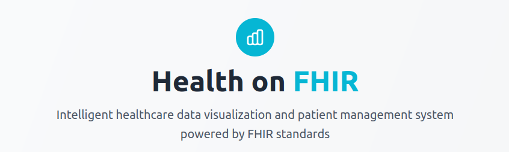
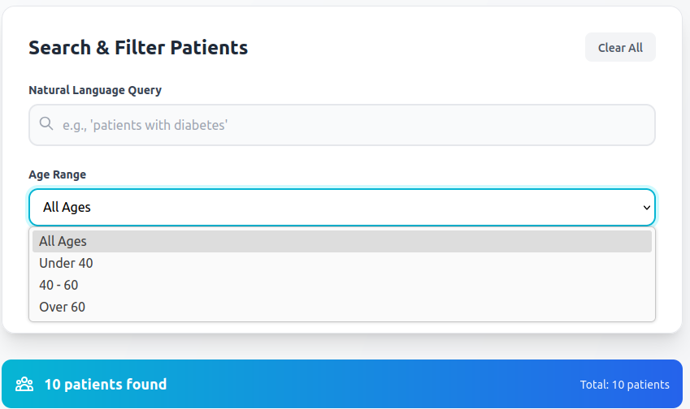
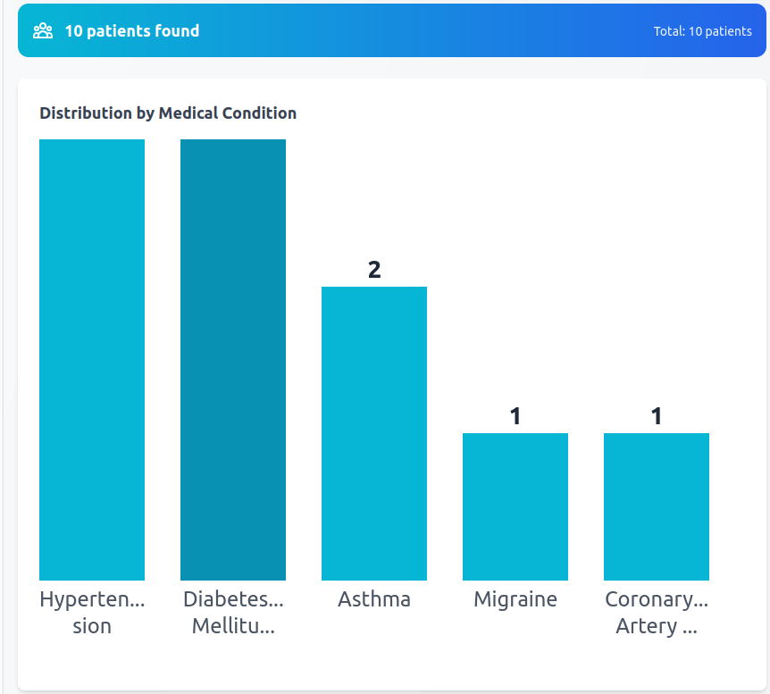
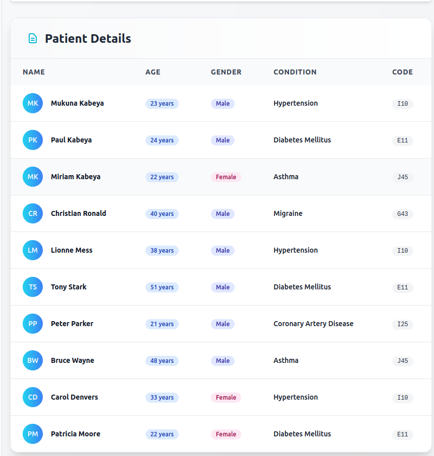

# Health on FHIR - Healthcare Data Visualization System

A modern React application for visualizing and managing healthcare patient data using FHIR (Fast Healthcare Interoperability Resources) standards. This application provides intelligent search capabilities, interactive data visualization, and comprehensive patient management features.

## 📸 Application Screenshots

### Main Dashboard

*Clean, modern interface with gradient background and professional healthcare styling*

### Search & Filter Interface

*Intuitive search with natural language queries and advanced filtering options*

### Interactive Bar Chart

*Real-time data visualization showing patient distribution by medical conditions*

### Patient Details Table

*Comprehensive patient information with color-coded badges and professional layout*

## 🚀 Features

- **Natural Language Search**: Query patients using plain English (e.g., "patients with diabetes")
- **Interactive Data Visualization**: Real-time bar charts showing patient distribution by medical conditions
- **Advanced Filtering**: Filter by age ranges, diagnosis codes, and medical conditions
- **Responsive Design**: Works seamlessly on desktop, tablet, and mobile devices
- **Modern UI/UX**: Clean, professional interface with smooth animations and transitions
- **Real-time Results**: Instant filtering and search results with live patient count updates

## 📋 Prerequisites

Before setting up the project, ensure you have the following installed on your system:

### Required Software

1. **Node.js** (Version 16.0 or higher)
   - Download from: https://nodejs.org/
   - Verify installation: `node --version`
   - Should return: `v16.x.x` or higher

2. **npm** (Usually comes with Node.js)
   - Verify installation: `npm --version`
   - Should return: `8.x.x` or higher
   - Alternative: **Yarn** (`yarn --version`)

3. **Git** (Optional, for cloning repository)
   - Download from: git@github.com:kerthnorth/onye-front-end-app.git
   - Verify installation: `git --version`

### System Requirements

- **Operating System**: Windows 10+, macOS 10.14+, or Linux (Ubuntu 18.04+)
- **RAM**: Minimum 4GB (8GB recommended)
- **Disk Space**: At least 500MB free space
- **Browser**: Modern web browser (Chrome 90+, Firefox 88+, Safari 14+, Edge 90+)

## 🛠️ Installation & Setup

### Step 1: Create a New React Project

```bash
# Create a new Vite + React project
npm create vite@latest health-app -- --template react
cd health-app
```

### Step 2: Install Required Dependencies

```bash
# Install core dependencies
npm install

# Install Tailwind CSS and PostCSS
npm install -D tailwindcss@^3.4.0 postcss autoprefixer

# Initialize Tailwind CSS
npx tailwindcss init -p
```

### Step 3: Configure Tailwind CSS

#### Update `tailwind.config.js`:
```javascript
/** @type {import('tailwindcss').Config} */
module.exports = {
  content: [
    "./index.html",
    "./src/**/*.{js,ts,jsx,tsx}",
  ],
  theme: {
    extend: {},
  },
  plugins: [],
};
```

#### Update `postcss.config.js`:
```javascript
module.exports = {
  plugins: [
    require('tailwindcss'),
    require('autoprefixer'),
  ],
}
```

### Step 4: Configure CSS

#### Update `src/index.css`:
```css
@tailwind base;
@tailwind components;
@tailwind utilities;
```

### Step 5: Update Main Files

#### Update `src/main.jsx`:
```javascript
import { StrictMode } from 'react'
import { createRoot } from 'react-dom/client'
import './index.css'
import App from './App.jsx'

createRoot(document.getElementById('root')).render(
  <StrictMode>
    <App />
  </StrictMode>,
)
```

#### Update `index.html`:
```html
<!doctype html>
<html lang="en">
  <head>
    <meta charset="UTF-8" />
    <link rel="icon" type="image/svg+xml" href="/vite.svg" />
    <meta name="viewport" content="width=device-width, initial-scale=1.0" />
    <title>AI on FHIR - Healthcare Data Visualization</title>
  </head>
  <body>
    <div id="root"></div>
    <script type="module" src="/src/main.jsx"></script>
  </body>
</html>
```

### Step 6: Add the Application Code

Replace the contents of `src/App.jsx` with the AI on FHIR application code (provided separately).

## 🚀 Running the Application

### Development Mode

```bash
# Start the development server
npm run dev

# Or with Yarn
yarn dev
```

The application will be available at `http://localhost:5173`

### Production Build

```bash
# Build for production
npm run build

# Preview the production build
npm run preview
```

### Build Output

The production build will be created in the `dist/` directory.

## 🗂️ Project Structure

```
health-app/
├── public/
│   └── vite.svg
├── src/
│   ├── App.jsx          # Main application component
│   ├── main.jsx         # Application entry point
│   ├── index.css        # Global styles with Tailwind directives
│   ├── barchart.png     # Bar chart screenshot
│   ├── details.png      # Patient details table screenshot
│   ├── healthon.png     # Main dashboard screenshot
│   └── searchfilter.png # Search and filter interface screenshot
├── index.html           # HTML template
├── package.json         # Dependencies and scripts
├── tailwind.config.js   # Tailwind configuration
├── postcss.config.js    # PostCSS configuration
├── vite.config.js       # Vite configuration
└── README.md           # This file
```

## 📦 Dependencies

### Core Dependencies
- **React** (^18.2.0): JavaScript library for building user interfaces
- **React DOM** (^18.2.0): React rendering for web browsers

### Development Dependencies
- **Vite** (^5.0.0): Fast build tool and development server
- **Tailwind CSS** (^3.4.0): Utility-first CSS framework
- **PostCSS** (^8.4.0): CSS transformation tool
- **Autoprefixer** (^10.4.0): CSS vendor prefixes

## 🎯 Usage Guide

### Application Interface Overview

The application consists of four main sections as shown in the screenshots above:

1. **Header Section** (`healthon.png`): Professional branding with Health on FHIR logo and description
2. **Search & Filter Panel** (`searchfilter.png`): Natural language search with dropdown filters
3. **Data Visualization** (`barchart.png`): Interactive bar chart showing condition distribution
4. **Patient Details** (`details.png`): Comprehensive table with patient information and badges

### Basic Navigation

1. **Search Patients**: Use the search bar to enter natural language queries
   - "all patients"
   - "patients with diabetes"
   - "patients under 40"

2. **Apply Filters**: Use dropdown menus to filter by:
   - Age ranges (Under 40, 40-60, Over 60)
   - Diagnosis codes (I10, E11, J45, etc.)

3. **View Results**: 
   - Bar chart shows patient distribution by medical conditions
   - Table displays detailed patient information
   - Results counter shows filtered vs. total patients

### Sample Queries

- `"diabetes"` - Shows all patients with diabetes
- `"hypertension"` - Shows patients with high blood pressure
- `"John"` - Shows patients named John
- `"asthma"` - Shows patients with asthma

## 🛠️ Troubleshooting

### Common Issues

#### 1. Tailwind Styles Not Loading
```bash
# Clear cache and restart
rm -rf node_modules/.vite
npm run dev
```

#### 2. PostCSS Configuration Error
Ensure `postcss.config.js` uses CommonJS syntax:
```javascript
module.exports = {
  plugins: [
    require('tailwindcss'),
    require('autoprefixer'),
  ],
}
```

#### 3. Build Errors
```bash
# Clear node_modules and reinstall
rm -rf node_modules package-lock.json
npm install
```

#### 4. Port Already in Use
```bash
# Kill process on port 5173
npx kill-port 5173
# Or use different port
npm run dev -- --port 3000
```

### Browser Compatibility

| Browser | Version | Status |
|---------|---------|--------|
| Chrome  | 90+     | ✅ Fully Supported |
| Firefox | 88+     | ✅ Fully Supported |
| Safari  | 14+     | ✅ Fully Supported |
| Edge    | 90+     | ✅ Fully Supported |

### Performance Tips

1. **Use React DevTools** for debugging component performance
2. **Enable production build** for better performance testing
3. **Monitor bundle size** using `npm run build` analysis
4. **Use browser caching** for static assets

## 🔧 Development

### Available Scripts

- `npm run dev` - Start development server
- `npm run build` - Build for production
- `npm run preview` - Preview production build
- `npm run lint` - Run ESLint (if configured)

### Code Style

This project follows standard React and JavaScript conventions:
- Use functional components with hooks
- Prefer const/let over var
- Use meaningful component and variable names
- Add comments for complex logic

### Adding New Features

1. Create new components in `src/components/`
2. Update mock data in the `mockPatients` array
3. Add new filter options in the filter configuration
4. Extend the search functionality in `handleQueryChange`

## 📝 Mock Data

The application uses mock patient data for demonstration:
- 10 sample patients
- Various medical conditions (Hypertension, Diabetes, Asthma, etc.)
- ICD-10 diagnosis codes
- Age ranges from 22 to 71 years

To add real data:
1. Replace `mockPatients` array with API calls
2. Update data structure if needed
3. Add error handling for API requests

## 🚀 Deployment

### Netlify (Recommended)

1. Build the project: `npm run build`
2. Deploy the `dist/` folder to Netlify
3. Configure redirects for client-side routing

### Vercel

1. Install Vercel CLI: `npm i -g vercel`
2. Run: `vercel`
3. Follow the deployment prompts

### GitHub Pages

1. Install gh-pages: `npm install --save-dev gh-pages`
2. Add to package.json:
   ```json
   "homepage": "https://yourusername.github.io/health-app",
   "scripts": {
     "predeploy": "npm run build",
     "deploy": "gh-pages -d dist"
   }
   ```
3. Run: `npm run deploy`

## 📄 License

This project is licensed under the MIT License - see the [LICENSE](LICENSE) file for details.

## 🤝 Contributing

1. Fork the repository
2. Create a feature branch: `git checkout -b feature-name`
3. Commit changes: `git commit -am 'Add feature'`
4. Push to branch: `git push origin feature-name`
5. Submit a pull request

## 📞 Support

For issues and questions:
- Create an issue on GitHub
- Check the troubleshooting section above
- Review Vite and React documentation

## 🔄 Updates

To update dependencies:
```bash
# Check outdated packages
npm outdated

# Update packages
npm update

# Update major versions (careful!)
npx npm-check-updates -u
npm install
```

---

**Made with ❤️ for healthcare data visualization**

## 📷 Screenshot Gallery

The application features a modern, professional interface designed specifically for healthcare data management:

- **Dashboard**: Clean header with Health on FHIR branding and intuitive navigation
- **Search Interface**: Natural language processing with autocomplete suggestions
- **Data Visualization**: Interactive charts that update in real-time based on filters
- **Patient Management**: Detailed patient information with color-coded medical data

For the best user experience, ensure your browser supports modern CSS features and JavaScript ES6+.